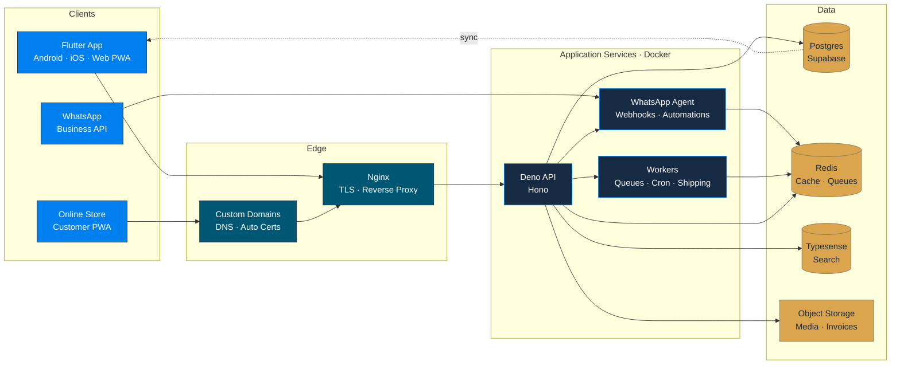
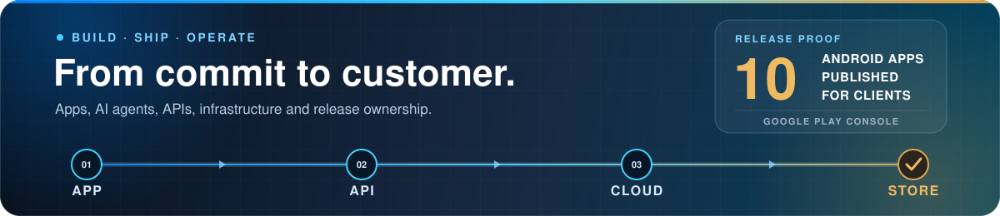

## About

I'm a full-stack product engineer based in New Delhi. I design, build and
operate production software from the UI down to the droplet.

At **[BillingFast](https://www.billingfast.com/)**, I work across the full
delivery chain: the Flutter app on Android, iOS and Web, merchant storefronts,
WhatsApp automation, backend services and infrastructure. I am comfortable
taking a feature from schema migration to production deployment and incident
response. I also manage Android publishing through Google Play Console and have
published **10 apps for my clients**.

[BillingFast product](https://www.billingfast.com/) ·
[Android app](https://play.google.com/store/apps/details?id=com.apnidukan.my_app)
· [iOS app](https://apps.apple.com/in/app/billing-fast-kirana-fast/id1567324958)
· [Web app](https://www.billingfast.com/app/) ·
[LinkedIn](https://www.linkedin.com/in/sankalp-pandey-108562217) ·
[Email](mailto:sankalppandey696@gmail.com)

---

## Selected work

### BillingFast — retail billing, inventory and commerce

A production platform that helps retailers manage billing, stock, reporting,
online sales and customer communication. The Android app has reached
**[50K+ downloads](https://play.google.com/store/apps/details?id=com.apnidukan.my_app)**,
with the product also shipping on iOS and the Web.

- **Multi-platform client:** Flutter across Android, iOS and Web, with
  Drift/SQLite local persistence, background cloud sync and conflict handling
- **Fast catalog workflows:** low-latency product search through Typesense for
  inventory and billing screens
- **Merchant storefronts:** catalog, cart, checkout, coupons and order tracking,
  including custom-domain onboarding and automated TLS
- **WhatsApp automation:** campaigns, order updates, cart recovery and
  rule-driven workflows on the
  [WhatsApp Business API](https://www.billingfast.com/blog/whatsapp-order-automation.html)
- **Production operations:** Deno/Hono services, Redis-backed queues, Postgres,
  Nginx and containerized deployments

### [Floofy](https://github.com/SankalpPyFever333/Floofy) — community platform for pet lovers

I built Floofy as a full-stack MERN application for people to share pet content,
discover products and services, manage profiles and interact through community
features. It includes authentication, administrative workflows and scheduled
database backups.

[Try the live application](https://floofy-eta.vercel.app/) ·
[Explore the source](https://github.com/SankalpPyFever333/Floofy)

`React` · `Redux` · `Node.js` · `Express` · `MongoDB` · `Firebase`

---

## The system I run

Flutter clients and merchant storefronts enter through Nginx and managed TLS.
Deno services coordinate Postgres, Redis queues, Typesense and object storage,
while background workers handle scheduled and asynchronous jobs. Local app data
syncs back to the cloud with explicit conflict handling.

---

## Core stack

- **Client:** Flutter, Dart, Drift, GetX, React, Next.js, TypeScript, Redux,
  Tailwind CSS, PWA
- **Backend and APIs:** Deno, Hono, Node.js, Express, GraphQL, webhooks,
  WhatsApp Cloud API
- **Data and search:** Postgres, Supabase, Redis, Typesense, SQLite, MongoDB,
  Firebase, object storage
- **Platform and delivery:** Docker, Nginx, Cloudflare, DigitalOcean, Let's
  Encrypt, Linux, GitHub Actions, Google Play Console, Bash

---

## Background

- **Master of Computer Applications**, Jamia Millia Islamia
- **Bachelor of Computer Applications**, National PG College

---

## Let's build something that ships

I enjoy hard product and infrastructure problems—especially the ones that need
ownership across client experience, APIs, data and deployment.

[Email me](mailto:sankalppandey696@gmail.com) ·
[Connect on LinkedIn](https://www.linkedin.com/in/sankalp-pandey-108562217) ·
[View my GitHub](https://github.com/SankalpPyFever333)

